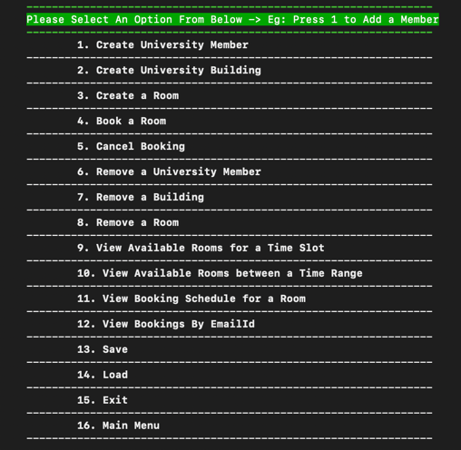
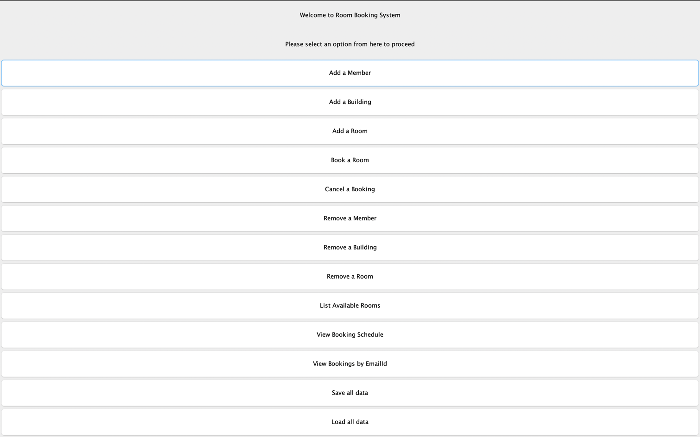

### Room Booking System

#### To Run Program:
```java
cd src
javac RoomBookingSystemMain
```

#### To Exit Program
Close both Cli and Gui
```java
//To close cli
Press 15

//To close gui
Close the gui frame

```

#### Glossary
`University` represents the model through which other models can gain access.
A `University` will need `UniversityMember` registered. This is synonymous to the Person and People
models mentioned in the requirement spec.
`Building` model represents the University's buildings. A `University` can have more than one `Building`.
Each `Building` model can have more than one `Room` model.
Each `Room` can be booked by more than one `UniversityMember`.
Thus, `Room` comprises multiple `BookingDateTime` models, representing the allowed booking information.

#### Views
RoomBookingSystem shows the following two views:
1. The Command Line Interface:

2. The Graphical User Interface: 


#### Working with the CLI and GUI
The CLI and GUI are two comprehensive views with options displayed in the menu.
To operate on CLI, please use the numerical commands from 1 through 16.
To operate on GUI, please click the buttons.
The features covered are:
1. Add, Remove `UniversityMember`.
2. Add, Remove `Building`.
3. Add, Remove `Room`.
4. Book, Cancel a reservation of a `Room` in a `Building` by the `UniversityMember`.
5. View `BookingDateTime` schedules for a room.
6. View Available rooms for given date and time range.
7. View Available rooms for given date and time slot.
8. View all bookings made by an emailId.
9. Load all data to a file for later use.
10. Upload data from the file when the program is re run.

#### Test Cases
Test cases are written for Models covering neutral, positive and negative scenarios.
Exception handling is also tested.

#### Features and Assumptions
1. Buildings and Rooms are displayed as selection options for members to choose from to input.
2. The program allows reservation for a single day. Thus date is the input accepted first, followed by time strings.
3. In the case of date and time format issues, the exceptions are handled and thrown upon completion of all inputs required.
4. Cli is made with colors for a better view and operation.
5. Data save and load do not append to existing file, rather they override the state.
6. Views are separated and pluggable with Controller.
7. To cancel a booking, a member is shown their bookings in dropdowns to select from.

#### Loading File
`uni.ser` is a file with test data populated.

#### Test users are:
1. testuser1@test.com
2. testuser2@test.com

#### Buildings are:
1. Sellars
2. Balfour
3. Tansen

#### Rooms are:
1. In Tansen Building, 0101, 0102
2. In Balfour Building, 0201, 0202
3. In Sellars Building, 0301, 0302

#### Bookings are:
1. 12-12-2022 | 09:00 | 10:00 | Tansen | 0101
2. 08-12-2022 | 14:00 | 16:00 | Balfour | 0202
3. 13-12-2022 | 09:10 | 09:20 | Balfour | 0201
